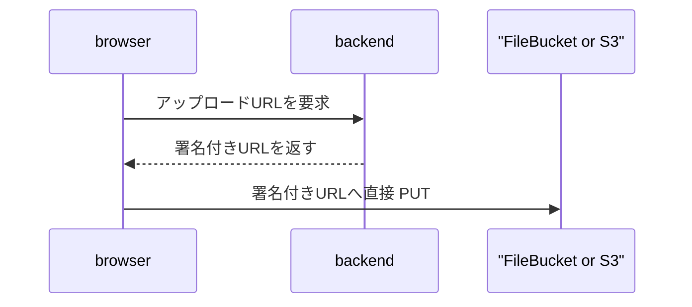

## これはなに

かわごえです。

2026/06/17 に 突如AWS Blocks というものが登場しました。

https://aws.amazon.com/jp/products/developer-tools/blocks/

https://github.com/aws-devtools-labs/aws-blocks

最初に見たときは「LocalStack みたいなやつ？」と思ったんですが、docs や README を見ると結構違いそうだなと思い、実際にS3 の署名付き URL でファイルを PUT する構成を題材にして、

- AWS Blocks を使う場合
- いつもの CDK + AWS SDK でやる場合

で、どこが変わるのかを検証してみようと思います。


検証コードはこちらです。

https://github.com/rrrraaaaa6/aws-blocks-demo


## AWS Blocks は何者か

公式 docs では、Block はこの3つを持つものとして説明されています。

- cloud resources
- runtime API
- local implementation

CDK は cloud resources を自分で書くものですし、
AWS SDK は runtime API を自分で書くためのものです。
LocalStack は AWS API 互換のローカル環境です。

AWS Blocks は従来バラバラだったこの3つを、アプリケーションから使う機能単位の `Block` として抽象化・まとめあげたもの。と考えるのが良さそうです。

`FileBucket` で言うと、ざっくりこうです。

cloud resources: S3 バケットや関連リソース
runtime API: `putUrl()` / `getUrl()` など
local implementation: ローカルでは `.bb-data/` 配下にファイルを保存

なんとなく概要はわかったものの、実際にサンプルアプリケーションを使ってどこが変わるのかを見てみようと思います。

## 作ったサンプル

リポジトリはこの形にしています。

```txt
aws-blocks-demo/
  client/  React + Vite
  server/  Backend application code
  cdk/     Deployment boundary
```

フローは普通の署名付き URL アップロードです。



サンプルの画面ではファイルを1つ選んで、`署名付きURLでPUT` を押すことで、backend から署名付き URL をもらい、そこにファイルを PUT するだけのサンプルアプリケーションです。


### server 側

`server/src/backend.ts` が、今回の backend の入口です。

AWS Blocks 的には、ここが composition root になります。
composition root という言葉だけだと少し大げさですが、要するに「アプリケーションで使う部品を最後に組み立てる場所」です。

今回だと、部品はこの3つです。

- `Scope`: Blocks 全体のまとまり
- `FileBucket`: ファイルを置くための Block
- `ApiNamespace`: browser から呼ぶ API

`createUploadUrlUseCase()` 自体は、署名付き URL を作るというアプリケーションの処理です。
そこに `FileBucket` を渡して、最後に `ApiNamespace` として公開しています。

なので、`backend.ts` は「業務ロジックを書く場所」というより、「Block と use case を配線して、外から呼べる API にする場所」です。

```ts
import { ApiNamespace, Scope } from '@aws-blocks/blocks';
import { createUploadUrlUseCase } from './application/uploads/create-upload-url.js';
import { createUploadsBucket } from './infrastructure/blocks/uploads-bucket.js';

const scope = new Scope('upload-demo');

const uploadsBucket = createUploadsBucket(scope);
const createUploadUrl = createUploadUrlUseCase(uploadsBucket);

export const api = new ApiNamespace(scope, 'api', () => ({
  async createUploadUrl(fileName: string, contentType: string) {
    return createUploadUrl({ fileName, contentType });
  },
}));
```

`FileBucket` は `server/src/infrastructure/blocks/uploads-bucket.ts` に閉じ込めています。

```ts
import { FileBucket, Scope } from '@aws-blocks/blocks';
import type { UploadUrlStore } from '../../application/uploads/create-upload-url.js';

export function createUploadsBucket(scope: Scope): UploadUrlStore {
  return new FileBucket(scope, 'uploads', {
    corsRules: [
      {
        allowedOrigins: ['*'],
        allowedMethods: ['PUT'],
        allowedHeaders: ['content-type'],
        maxAge: 300,
      },
    ],
  });
}
```

`application/` や `domain/` は AWS Blocks を import しません。
アプリケーション側は `putUrl()` を持つ port に依存します。
その port を `FileBucket` で満たすのが `infrastructure/blocks/` です。

```ts
export type UploadUrlStore = {
  putUrl(
    key: string,
    options: {
      expiresIn: number;
      contentType: string;
    },
  ): Promise<string>;
};
```

これで、Blocks を使いつつも、アプリケーション層全体が `@aws-blocks/blocks` まみれになるのは避けています。

AWS Blocks はアプリケーションに近い場所に入ってくるので、何も考えずに使うと業務ロジックとインフラ都合が混ざります。
一方で port と adapter にしておけば、「ファイルアップロードというユースケース」と「それを FileBucket で実現すること」を分けられます。

初見だと「なんでインフラっぽい `FileBucket` が server にあるの？」となると思いますが、ここが AWS Blocks の特徴です。
冒頭に説明した通り、`FileBucket` は単なる CDK construct ではなく、runtime API と local implementation も持っています。

そのため、server のアプリケーションコードから `putUrl()` のメソッドを呼べる必要があります。
結果的に、 `FileBucket` は `cdk/` に置くのではなく、server の backend 定義の中に出てきます。

### client 側

フロントエンドは React + Vite にしています。

client は Blocks API の URL を `VITE_BLOCKS_API_URL` で受け取ります。
未指定の場合はローカルの dev server を見ます。

```ts
const api = ApiNamespaceClient<typeof backendApi>('api', {
  url: import.meta.env.VITE_BLOCKS_API_URL ?? 'http://localhost:3001/aws-blocks/api',
});
```

アップロード処理は普通の署名付きURLに対するPUTの処理です。

```ts
const signed = await api.createUploadUrl(file.name, file.type || 'application/octet-stream');

const putResponse = await fetch(signed.uploadUrl, {
  method: 'PUT',
  headers: {
    'content-type': signed.requiredHeaders['content-type'],
  },
  body: file,
});
```

ここは SDK 直書きの場合とあまり変わりません。

フロントエンドから見ると、「backend から URL をもらって PUT する」という普通の構成です。
違うのは、その URL を作る backend 側が `S3Client + getSignedUrl` ではなく `FileBucket.putUrl()` になっているところです。

### 公式のサンプルから変えたところ

今回のリポジトリは、AWS Blocks のサンプルをベースにしつつも、少し構成を変えています。
自分が普段よく使う `/client` `/server` `/cdk` といったモノレポの分け方をした時に、AWS Blocks をどこに置くのが自然かをみるためにこの構成にしています。

- `client/`: 画面。署名付き URL をもらって PUT するだけ
- `server/`: アプリケーションの use case と Blocks の backend 定義を持つ
- `cdk/`: AWS に載せるための CDK app を持つ

特に意図的に変えているのは CDK 側です。

公式の `create-blocks-app` テンプレートだと、だいたいこういう形になっています。

```txt
aws-blocks/
  index.ts
  index.handler.ts
  index.cdk.ts
  scripts/
```

`cdk.json` も `aws-blocks/index.cdk.ts` を CDK app として実行します。

```json
{
  "app": "npx tsx -C cdk aws-blocks/index.cdk.ts"
}
```

そして `aws-blocks/index.cdk.ts` の中で `BlocksStack.create()` します。

```ts
export const blocksStack = await BlocksStack.create(app, stackName, {
  backendHandlerPath: join(__dirname, 'index.handler.ts'),
  backendCDKPath: join(__dirname, 'index.ts'),
});
```

自分が普段触っている構成だと、AWSリソースへのデプロイの入口は `cdk/` にあります。
`cdk deploy` する対象も、AWS account / region / stack 名 / context も `cdk/` 側で管理することが多いです。

今回は、公式テンプレートの `aws-blocks/index.cdk.ts` に相当する責務を、そのまま `server/` の中に混ぜ込むのではなく、`cdk/` 側に寄せています。
一方で、`FileBucket` や `ApiNamespace` の定義自体は、引き続き `server/src/backend.ts` 側に置いています。

ローカルでBlocks API を立ち上げるために、`server/package.json` で `@aws-blocks/blocks/scripts` の `startDevServer()` を使っています。

```ts
startDevServer({ backendPath: 'src/backend.ts', port: 3001 });
```

一方で、AWS への synth / deploy は、Blocks の deploy script に閉じず、普通の CDK app から `BlocksBackend.create()` を呼ぶ形にしています。

```ts
import { BlocksBackend } from '@aws-blocks/blocks/cdk';

const backend = await BlocksBackend.create(stack, 'backend', {
  backendHandlerPath: path.join(serverSrc, 'handler.ts'),
  backendCDKPath: path.join(serverSrc, 'backend.ts'),
});
```

実際のプロジェクトだと、AWS リソースのデプロイ責務はだいたい `cdk/` 側にあります。
S3 だけではなく、VPC、ECS、CloudFront、Route 53、WAF、監視、アラームなども一緒に扱うことが多いはずです。

その前提で AWS Blocks を使うなら、`FileBucket` のようなアプリ寄りのリソース定義は `server/` 側に置きつつ、
最終的に「いつ、どの stack として、どの account / region にデプロイするか」は `cdk/` 側で分けて管理するのがまだ自然かなと思います。

既存構成に無理やり混ぜたかったというより、既存の `/client` `/server` `/cdk` の責務を大きく崩さず、AWS Blocks を部分的に使うならこうなる、という確認です。

### cdk 側

いつもの CDK だと、`cdk/` の中に `new s3.Bucket()` を書き、server 側は `process.env.BUCKET_NAME` を受け取って、AWS SDK で S3 への操作を書いて、という形になります。

CDK は何をしているのかというと、server 側にある Blocks の定義を読んで、AWS にデプロイできる形に変換しています。

```ts
const backend = await BlocksBackend.create(stack, 'backend', {
  backendHandlerPath: path.join(serverSrc, 'handler.ts'),
  backendCDKPath: path.join(serverSrc, 'backend.ts'),
});
```

`backendCDKPath` に `server/src/backend.ts` を渡しています。

ここで `server/src/backend.ts` が CDK synthesis context で評価されます。

つまり、CDK の `synth` 時に `backend.ts` が読まれます。
その中にある `FileBucket` が S3 bucket に、`ApiNamespace` が Lambda + API Gateway の backend API になります。

雑に言うと、こうです。

```txt
server/src/backend.ts
  FileBucket を作る
  ApiNamespace を作る
        |
        | cdk synth / deploy
        v
AWS
  S3 bucket
  Lambda
  API Gateway
```

なので、CDK が薄いのは「インフラを何も定義していない」からではありません。
インフラ定義の入口が `server/src/backend.ts` 側に移っていて、`cdk/` はそれを AWS に載せるための wrapperのような構成にしています。

この構成だと、`cdk/` は deployment lifecycle の owner で、`server/` は application lifecycle の ownerになります。

今までの `cdk/` は、S3 バケットの CORS や IAM まで細かく持っていました。
今回は `FileBucket` に紐づく定義は `server/` 側にあり、`cdk/` はそれを AWS に載せる境界になっています。

### CDK synth 結果を見る

ここまでだと「Blocks がよしなに S3 や Lambda を作ってくれる」という話で終わってしまうので、実際に `cdk synth` で出た CloudFormation template も見てみます。

今回の template では、主にこのあたりが作られていました。

```txt
AWS::S3::Bucket             2
AWS::Lambda::Function       3
AWS::ApiGateway::RestApi    1
AWS::ApiGateway::Method     5
AWS::IAM::Role              4
AWS::IAM::Policy            2
```

アプリケーション本体として見るべきなのは、アップロード用の S3 bucket、Blocks API を受ける Lambda、API Gateway、Lambda 実行 role の policy です。
残りには、Blocks の設定ファイルを置く bucket や、CDK の bucket deployment 用 custom resource も含まれています。

まず `FileBucket` から作られた S3 bucket です。

```json
{
  "Type": "AWS::S3::Bucket",
  "Properties": {
    "BucketName": "aws-blocks-upload-demo-prod-upload-demo-uploads",
    "BucketEncryption": {
      "ServerSideEncryptionConfiguration": [
        {
          "ServerSideEncryptionByDefault": {
            "SSEAlgorithm": "AES256"
          }
        }
      ]
    },
    "CorsConfiguration": {
      "CorsRules": [
        {
          "AllowedHeaders": ["content-type"],
          "AllowedMethods": ["PUT"],
          "AllowedOrigins": ["*"],
          "MaxAge": 300
        }
      ]
    },
    "PublicAccessBlockConfiguration": {
      "BlockPublicAcls": true,
      "BlockPublicPolicy": true,
      "IgnorePublicAcls": true,
      "RestrictPublicBuckets": true
    }
  },
  "UpdateReplacePolicy": "Retain",
  "DeletionPolicy": "Retain"
}
```

`FileBucket` の `corsRules` に書いた `PUT` と `content-type` が、そのまま S3 bucket の CORS に落ちています。
一方で、bucket encryption や public access block も付いています。

ここで見ておきたいのは、`AllowedOrigins` が `*` になっていることです。
今回はデモなので雑に許可していますが、本番ならフロントエンドの origin に絞るべきです。
Blocks を使うと S3 bucket を直接書かなくてもよくなりますが、CORS の設計責任が消えるわけではありません。

次に API を受ける Lambda です。

```json
{
  "Type": "AWS::Lambda::Function",
  "Properties": {
    "Handler": "index.handler",
    "Runtime": "nodejs24.x",
    "MemorySize": 2048,
    "Timeout": 900,
    "Environment": {
      "Variables": {
        "NODE_ENV": "production",
        "BLOCKS_STACK_NAME": "aws-blocks-upload-demo-prod",
        "BLOCKS_CONFIG_BUCKET": { "Ref": "BlocksConfigBucket439874BD" },
        "BLOCKS_CONFIG_KEY": "blocks-config.json"
      }
    }
  }
}
```

`ApiNamespace` で公開した API は、最終的にはこの Lambda に載ります。
`BLOCKS_CONFIG_BUCKET` と `BLOCKS_CONFIG_KEY` が入っているので、実行時には Blocks の設定を S3 から読む構成になっていることもわかります。

ここは SDK 直書きの構成と少し見方が違います。
SDK 直書きなら「自分の Lambda が `UPLOADS_BUCKET_NAME` を環境変数で受け取る」形にしがちですが、Blocks では Blocks の runtime が設定 bucket を経由して、`FileBucket` などの構成を解決しているように見えます。

API Gateway 側は、`/aws-blocks/api` の `POST` が Lambda proxy integration になっています。

```json
{
  "Type": "AWS::ApiGateway::Method",
  "Properties": {
    "AuthorizationType": "NONE",
    "HttpMethod": "POST",
    "Integration": {
      "IntegrationHttpMethod": "POST",
      "Type": "AWS_PROXY"
    }
  }
}
```

client から `ApiNamespaceClient` で呼んでいる先は、この API Gateway の endpoint です。
CloudFormation output には `/prod/aws-blocks/api` まで含んだ URL が出ます。

```json
{
  "Value": "https://${RestApiId}.execute-api.${Region}.${URLSuffix}/prod/aws-blocks/api"
}
```

今回は `AuthorizationType` が `NONE` なので、API Gateway 自体では認証していません。
署名付き URL を作る API を公開するなら、実際のアプリでは Cognito、JWT authorizer、IAM auth、別の認証済み backend 経由にするなど、どこでユーザーを認証するかを別途決める必要があります。

最後に Lambda 実行 role の policy です。

```json
{
  "Type": "AWS::IAM::Policy",
  "Properties": {
    "PolicyDocument": {
      "Statement": [
        {
          "Effect": "Allow",
          "Action": [
            "s3:GetObject*",
            "s3:GetBucket*",
            "s3:List*",
            "s3:DeleteObject*",
            "s3:PutObject",
            "s3:PutObjectLegalHold",
            "s3:PutObjectRetention",
            "s3:PutObjectTagging",
            "s3:PutObjectVersionTagging",
            "s3:Abort*"
          ],
          "Resource": [
            { "Fn::GetAtt": ["uploaddemouploadsbucket0AD45A41", "Arn"] },
            { "Fn::Join": ["", [{ "Fn::GetAtt": ["uploaddemouploadsbucket0AD45A41", "Arn"] }, "/*"]] }
          ]
        },
        {
          "Effect": "Allow",
          "Action": "s3:GetObject",
          "Resource": "arn:aws:s3:::${BlocksConfigBucket}/blocks-config.json"
        }
      ]
    }
  }
}
```

`putUrl()` で署名付き URL を発行するため、Lambda には対象 bucket への S3 権限が付いています。
ここは本番で必ず確認したいところです。

特に目につくのは、`s3:PutObject` だけではなく、`s3:DeleteObject*`、`s3:List*`、`s3:Abort*` なども含まれている点です。
今回のユースケースだけを見ると「アップロード URL を発行するだけ」に見えますが、生成された policy はもう少し広めです。
Blocks の API が `putUrl()` 以外の操作も想定しているためだと思いますが、厳密な最小権限が必要な環境では、この policy をそのまま許容できるか確認が必要です。

この synth 結果を見ると、AWS Blocks は「CDK を不要にするもの」というより、S3/Lambda/API Gateway/IAM を生成する CDK construct と runtime のまとまりとして見るほうが近いです。
アプリケーションコードでは `FileBucket.putUrl()` として扱えますが、AWS 上では普通に S3 bucket、Lambda、API Gateway、IAM policy ができています。

なので、本番に寄せて判断するなら、少なくとも次の4つは synth 結果で確認したほうがよさそうです。

- S3 bucket の CORS と public access block
- API Gateway の path、method、authorization
- Lambda の runtime、timeout、memory、environment
- Lambda role に付く S3 権限の広さ

ローカルで動くことだけを見ると Blocks の便利さが目立ちます。
一方で、AWS に載せる段階では、生成された CloudFormation を読んで、普段の CDK と同じようにセキュリティや運用の観点で確認する必要があります。

### ローカルで動かす

AWS Blocks は Node.js 22 以上が必要です。

```sh
npm install
npm run dev
```

起動するとこうなります。

```txt
client:     http://localhost:3000
server:     http://localhost:3001
Blocks API: http://localhost:3001/aws-blocks/api
```

この状態でファイルを PUT すると、`FileBucket` の local implementation が使われ、ファイルは `.bb-data/` 配下に保存されます。


文字が小さくて見づらいですが、開発者ツールのネットワークタブで、`PUT` 先の URL が `http://localhost:3001/aws-blocks/api/uploads/put-url` になっていることがわかります。

実際に、`.bb-data/` 配下にファイルが保存されていることも確認できました。


ここが LocalStack との一番大きな違いかなと思います。
S3 互換 endpoint に向けているわけではなく、`FileBucket` のローカル実装が、アップロード URL とファイル保存先を提供しています。

### AWS にデプロイして同じ画面から PUT する

次に AWS 側です。

CDK synth では、主にこのあたりが出ます。

- `AWS::S3::Bucket`
- `AWS::Lambda::Function`
- `AWS::ApiGateway::RestApi`
- `BlocksApiUrl` output

デプロイはこうです。
本来であれば、`allowedOrigins` はフロントエンドの URL に合わせるべきですが、今回は.envファイルでローカルと実際のAWS上が切り替えられれば十分だったので、contextで許可するオリジンを渡す構成にしています。

```sh
npm run cdk:deploy -- --context 'allowedOrigins=^http://localhost:3000$'
```

デプロイ後、CloudFormation output の `BlocksApiUrl` を client 側に渡します。

```sh
VITE_BLOCKS_API_URL='https://xxxxx.execute-api.ap-northeast-1.amazonaws.com/prod/aws-blocks/api' npm run dev:client
```

サーバー側のアプリケーションコードはS3バケットの向き先をローカル・AWSで切り替える必要がないので、同じコードでローカルとAWSの両方を動かせます。

実際に試してみると、ローカルでは `.bb-data/` に保存されていたファイルが、AWS 側では S3 バケットに保存されます。


### いつもの CDK + SDK だとどうなるか

AWS Blocks を使わない場合、同じ構成はこうなります。

```txt
client/
  React / Next.js
  backend から署名付きURLをもらって PUT

server/
  S3Client
  PutObjectCommand
  getSignedUrl()

cdk/
  S3 bucket
  CORS
  IAM
```

server 側はだいたいこういうコードになります。

```ts
import { PutObjectCommand, S3Client } from '@aws-sdk/client-s3';
import { getSignedUrl } from '@aws-sdk/s3-request-presigner';

const s3 = new S3Client({});

export async function createUploadUrl(fileName: string, contentType: string) {
  const key = `uploads/${crypto.randomUUID()}-${fileName}`;

  const command = new PutObjectCommand({
    Bucket: process.env.UPLOADS_BUCKET_NAME,
    Key: key,
    ContentType: contentType,
  });

  const uploadUrl = await getSignedUrl(s3, command, {
    expiresIn: 300,
  });

  return { key, uploadUrl };
}
```

これをローカルでちゃんと動かすとなると、追加で考えることが増えます。

- LocalStack / MinIO / 実 AWS のどれに向けるか
- `endpoint` と `forcePathStyle` をどう切り替えるか
- CORS をローカルと AWS でどう揃えるか
- テストでは S3 をモックするのか
- ローカルで発行した署名付き URL をブラウザから叩けるか

AWS Blocks の `FileBucket` を使うと、このあたりを「S3 互換 endpoint」ではなく「ファイルを置くローカルで動くBlock」として扱えるのはとても便利です。

## AWS Blocksの何が嬉しいのか

一番大きいのは、ローカルと AWS の差し替え方です。
SDK 直書きの場合、ローカルで動かすには AWS API 互換の何かを用意するか、実 AWS に向けるか、モックするかを選びます。

AWS Blocks の場合、`FileBucket` が local implementation を持っています。
なので、ローカルでは `.bb-data/`、AWS では S3、という切り替えを Block 側に任せられます。

これは、アプリケーション側の実装と AWS 側の構築担当が分かれているケースで特に効きそうです。
たとえば S3 bucket や IAM、API Gateway まわりの準備を別チームが進めている間でも、アプリケーション側ではローカルで `putUrl()` を呼び、ファイルが `.bb-data/` に保存されるところまで先に確認できます。

もちろん、最終的な AWS 側の確認は必要ですし、CORS、IAM、API Gateway、Lambda、実際の S3 bucket での挙動はデプロイして見る必要がありますが、少なくともAWSサービスとの連携についてはローカルで早めに動かせるのが、うれしいポイントにはなるかなと思います。

## まとめ

AWS Blocks は、LocalStack の代替というより、アプリケーションと密接に関わる AWS リソースを `Block` として扱うためのものです。

今回の `FileBucket` では、

- ローカルでは `.bb-data/` に保存する
- AWS では S3 bucket になる
- server 側では `putUrl()` を呼ぶ
- CDK 側は `BlocksBackend.create()` で server の定義を deployment boundary に載せる

という形になりました。

今回は、既存の `/client` `/server` `/cdk` という構成を大きく崩さずに、AWS Blocks をどう使えそうかを見ました。
特に、ローカル起動時に S3 相当の挙動を `.bb-data/` で確認できるところは、既存構成に部分的に入れる場合でも使いやすそうです。

ただ、本来の AWS Blocks は、サーバー、フロントエンド、インフラをまとめて扱うところまで含めた体験が大きそうです。
今回は既存構成に寄せて試しましたが、全部を AWS Blocks 前提で組んだ場合にどういう使い方になるのかは、今後も試していきたいと思います。
